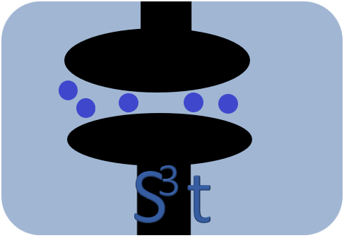
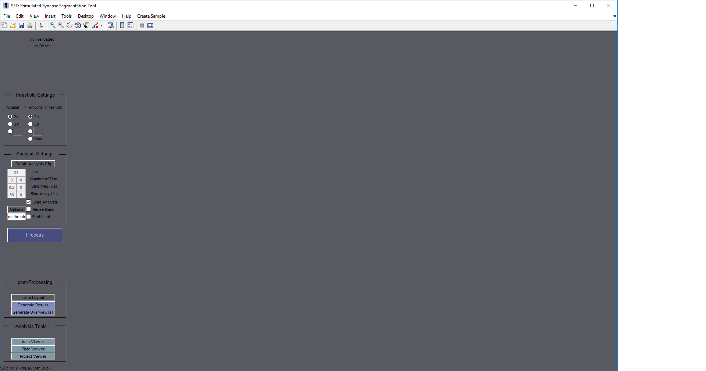

# S3T: Stimulated Synapse Segmentation Tool
*Disclaimer: This software is still in active development and for this, not (yet) user nor*
*developper friendly.*

A tool to segment and analyse high throughput screen recordings of electronically stimulated synapses.

Some examples to get you started can be created in the GUI:

Start with: **S3T.m** for a GUI start

and use the toolbar

**createSampleRecordigs/createSampleRecordigs**: To create artificial 96-well plate recordings.
(This can take up to 1 hour and ~15GB of space.)

To the run analysis:
1) Press that Big Process Button.

(Windows precompiled binaries are available.)

Author: Michiel Van Dyck (2018) Antwerp, Belgium

